<!-- =========================================================
     🌸 Tuğba Zengin — A Garden of Code 🌸
     ========================================================= -->

<!-- BLOOMING BOUQUET HEADER -->
<div align="center">



</div>

<br/>

<!-- ============================================================
     SECTION 1 — A LITTLE LETTER
     ============================================================ -->

> 💌 **a letter from my desk**
>
> Hi, I'm Tuğba — an iOS developer who spends mornings sketching SwiftUI views in a notebook, afternoons wrangling PostgreSQL schemas, and evenings deploying with Docker over a cup of jasmine tea. I think software is a small, kind act done at scale. This page is a window into the things I'm planting, tending, and harvesting.
>
> — written from somewhere between Xcode and a terminal 🌷

<br/>

<!-- ============================================================
     SECTION 2 — POLAROID GALLERY
     ============================================================ -->

## 📷 from the studio

<table>
<tr>
<td align="center" width="33%">

<sub><i>· No. 01 ·</i></sub><br/>
<b><code>Bloom.swift</code></b><br/>
<sub>a SwiftUI journaling app with<br/>haptic feedback & widgets</sub><br/><br/>
<code>SwiftUI · Combine · CoreData</code>

</td>
<td align="center" width="33%">

<sub><i>· No. 02 ·</i></sub><br/>
<b><code>Petal.next</code></b><br/>
<sub>a Next.js admin dashboard with<br/>server actions & streaming UI</sub><br/><br/>
<code>Next.js 15 · Prisma · Postgres</code>

</td>
<td align="center" width="33%">

<sub><i>· No. 03 ·</i></sub><br/>
<b><code>Greenhouse.ci</code></b><br/>
<sub>a self-hosted GitHub Actions<br/>runner for iOS + web deploys</sub><br/><br/>
<code>Docker · Fastlane · GH Actions</code>

</td>
</tr>
</table>

<sub>📌 these are working titles — sometimes a project changes its name twice before I'm done with it.</sub>

<br/>

<!-- ============================================================
     SECTION 3 — TOOLBOX AS A SHELF
     ============================================================ -->

## 🧺 the toolbox on my shelf

<table>
<tr><th align="left">🍎</th><td align="left"><b>iOS</b> &nbsp; Swift · SwiftUI · UIKit · Combine · Core Data · XCTest · TestFlight</td></tr>
<tr><th align="left">🌸</th><td align="left"><b>web</b> &nbsp; Next.js · React · TypeScript · Tailwind · tRPC · React Query</td></tr>
<tr><th align="left">🌱</th><td align="left"><b>server</b> &nbsp; Node.js · Express · NestJS · Prisma · REST · GraphQL</td></tr>
<tr><th align="left">🐘</th><td align="left"><b>data</b> &nbsp; PostgreSQL · Redis · SQLite · query tuning · migrations</td></tr>
<tr><th align="left">🐳</th><td align="left"><b>devops</b> &nbsp; Docker · Docker Compose · GitHub Actions · Fastlane · Nginx · Linux</td></tr>
<tr><th align="left">🎀</th><td align="left"><b>design</b> &nbsp; Figma · SF Symbols · Storybook · accessibility-first thinking</td></tr>
</table>

<br/>

<!-- ============================================================
     SECTION 4 — TODAY I'M WORKING ON
     ============================================================ -->

## 🌿 today on my desk

```diff
+ shipping a SwiftUI animation that took 4 prototypes to feel right
+ writing a CI workflow that runs SwiftLint, tests, and ships TestFlight
~ reviewing a friend's Next.js PR
~ reading: "Hackers & Painters" — for the fifth time, no regrets
- waiting on: a flaky Xcode preview to please render
```

<br/>

<!-- ============================================================
     SECTION 5 — ON THE NIGHTSTAND (replaces stats)
     ============================================================ -->

## 📚 on my nightstand

<table>
<tr>
<td width="50%" valign="top">

**📖 reading**
<sub>· *The Pragmatic Programmer* — Hunt & Thomas<br/>
· *Refactoring* — Martin Fowler<br/>
· *A Philosophy of Software Design* — Ousterhout</sub>

**🎧 listening to while coding**
<sub>· lofi girl ↗ youtube<br/>
· *In Rainbows* — Radiohead<br/>
· *Currents* — Tame Impala</sub>

</td>
<td width="50%" valign="top">

**☕ favorite coding fuel**
<sub>· jasmine tea (morning)<br/>
· flat white (afternoon)<br/>
· chamomile (when CI is angry)</sub>

**🌟 chasing this year**
<sub>· ship a personal iOS app to TestFlight<br/>
· contribute to a Swift open-source project<br/>
· write a blog post about CI/CD for iOS<br/>
· learn SwiftData properly</sub>

</td>
</tr>
</table>

<br/>

<!-- ============================================================
     SECTION 6 — A SHORT MANIFESTO
     ============================================================ -->

## 🌼 how I like to build

🪴 &nbsp; **small commits, often.** &nbsp; like watering a plant.<br/>
🌸 &nbsp; **a name worth typing.** &nbsp; variables are tiny love letters.<br/>
🍃 &nbsp; **readable beats clever.** &nbsp; future me will say thank you.<br/>
🌷 &nbsp; **animation has manners.** &nbsp; quick, gentle, never in the way.<br/>
🦋 &nbsp; **deploy on a friday?** &nbsp; only if there's coffee for monday.<br/>
🌻 &nbsp; **accessibility is not optional.** &nbsp; it's the welcome mat.

<br/>

<!-- ============================================================
     SECTION 7 — POSTCARD
     ============================================================ -->

## ✉️ send me a postcard

<pre align="center" style="background:#fdf2f8;border:2px dashed #ec4899;padding:18px;display:inline-block;">
┌─────────────────────────────────────────────────┐
│                                                 │
│   to: Tuğba Zengin                  🌷 stamp 🌷 │
│       somewhere with good wifi                  │
│       Türkiye                                   │
│                                                 │
│   re: a project · a question · a coffee idea    │
│                                                 │
│   ✿ LinkedIn  /in/tugbazengin                   │
│   ✿ Mail      tugbazengin@example.com           │
│   ✿ GitHub    @tugbazengin                      │
│                                                 │
└─────────────────────────────────────────────────┘
</pre>

<div align="center">
<br/>

<a href="https://linkedin.com/in/tugbazengin"></a>
&nbsp;
<a href="mailto:tugbazengin@example.com"></a>
&nbsp;


</div>

<br/>

<div align="center">

<sub>🌸  *thanks for stopping by — leave the garden a little prettier than you found it.*  🌸</sub>

</div>
